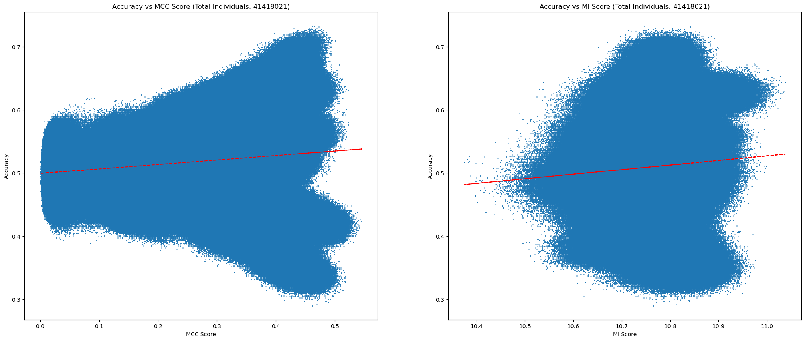

# New Unsupervised Learning Method Results

## First Experiment (Mutual Information)

Here is the result of the first experiment:

| Population Size | Max Generations | Mutation Rate | Crossover Rate | All Time Best Fitness | All Time Best Fitness Accuracy |
|-----------------|-----------------|---------------|----------------|-----------------------|--------------------------------|
| 100             | 100             | 0.2           | 0.8            | 0.5026                | 10.9137                        |
| 100             | 1000            | 0.2           | 0.8            | 0.5008                | 10.8764                        |
| 1000            | 100             | 0.2           | 0.8            | 0.4358                | 10.9358                        |
| 100             | 1000            | 0.2           | 0.8            | 0.5096                | 10.9017                        |
| 100             | 1500            | 0.2           | 0.8            | 0.5237                | 10.8896                        |
| 100             | 2000            | 0.2           | 0.8            | 0.5219                | 10.8972                        |
| 300             | 2000            | 0.4           | 0.8            | 0.5395                | 10.9612                        |
| 300             | 2000            | 0.2           | 0.8            | 0.5219                | 10.9134                        |
| 300             | 2000            | 0.3           | 0.8            | 0.4991                | 10.9353                        |
| 300             | 2000            | 0.4           | 0.8            | 0.5131                | 10.9844                        |
| 300             | 2000            | 0.3           | 0.8            | 0.4991                | 10.9632                        |
| 300             | 2000            | 0.2           | 0.8            | 0.4797                | 10.9362                        |
| 300             | 3000            | 0.3           | 0.8            | 0.5079                | 10.9354                        |
| 300             | 3000            | 0.5           | 0.8            | 0.4938                | 10.9459                        |
| 500             | 2000            | 0.5           | 0.9            | 0.5395                | 10.9601                        |
| 500             | 2000            | 0.3           | 0.9            | 0.5377                | 10.9534                        |
| 500             | 2000            | 0.4           | 0.9            | 0.4956                | 10.9634                        |
| 500             | 2000            | 0.4           | 0.9            | 0.5079                | 10.9968                        |
| 500             | 2000            | 0.5           | 0.9            | 0.5061                | 10.9708                        |
| 500             | 2000            | 0.6           | 0.9            | 0.5008                | 10.9664                        |
| 500             | 2000            | 0.5           | 0.9            | 0.5114                | 10.9985                        |
| 500             | 2000            | 0.6           | 0.9            | 0.5114                | 10.9795                        |
| 500             | 2000            | 0.4           | 0.9            | 0.4780                | 10.9700                        |

## Second Experiment (Multiple Correlation Coefficient)

Here is the result of the second experiment:

| Population Size | Max Generations | Mutation Rate | Crossover Rate | All Time Best Fitness | All Time Best Fitness Accuracy |
|-----------------|-----------------|---------------|----------------|-----------------------|--------------------------------|
| 100             | 100             | 0.2           | 0.8            | 0.4411                | 0.1442                         |
| 100             | 1000            | 0.2           | 0.8            | 0.5272                | 0.2352                         |
| 1000            | 100             | 0.2           | 0.8            | 0.3778                | 0.2688                         |
| 100             | 1000            | 0.2           | 0.8            | 0.5307                | 0.2332                         |
| 100             | 1500            | 0.2           | 0.8            | 0.5079                | 0.2820                         |
| 100             | 2000            | 0.2           | 0.8            | 0.5043                | 0.3268                         |
| 300             | 2000            | 0.4           | 0.8            | 0.5799                | 0.4717                         |
| 300             | 2000            | 0.3           | 0.8            | 0.4024                | 0.5187                         |
| 300             | 2000            | 0.2           | 0.8            | 0.3620                | 0.4834                         |
| 300             | 2000            | 0.3           | 0.8            | 0.6643                | 0.4944                         |
| 300             | 2000            | 0.4           | 0.8            | 0.5184                | 0.4997                         |
| 300             | 2000            | 0.2           | 0.8            | 0.4762                | 0.4614                         |
| 300             | 3000            | 0.3           | 0.8            | 0.7100                | 0.5014                         |
| 300             | 3000            | 0.5           | 0.8            | 0.5623                | 0.4777                         |
| 500             | 2000            | 0.5           | 0.9            | 0.5729                | 0.5135                         |
| 500             | 2000            | 0.3           | 0.9            | 0.4235                | 0.5455                         |
| 500             | 2000            | 0.4           | 0.9            | 0.3339                | 0.5182                         |
| 500             | 2000            | 0.5           | 0.9            | 0.5975                | 0.5072                         |
| 500             | 2000            | 0.4           | 0.9            | 0.5764                | 0.5230                         |
| 500             | 2000            | 0.6           | 0.9            | 0.4868                | 0.4849                         |
| 500             | 2000            | 0.4           | 0.9            | 0.6309                | 0.5221                         |
| 500             | 2000            | 0.6           | 0.9            | 0.5922                | 0.4874                         |
| 500             | 2000            | 0.5           | 0.9            | 0.5395                | 0.4755                         |

## Third Experiment (Scatter Plot Analysis)

Here is the result of the third experiment:

